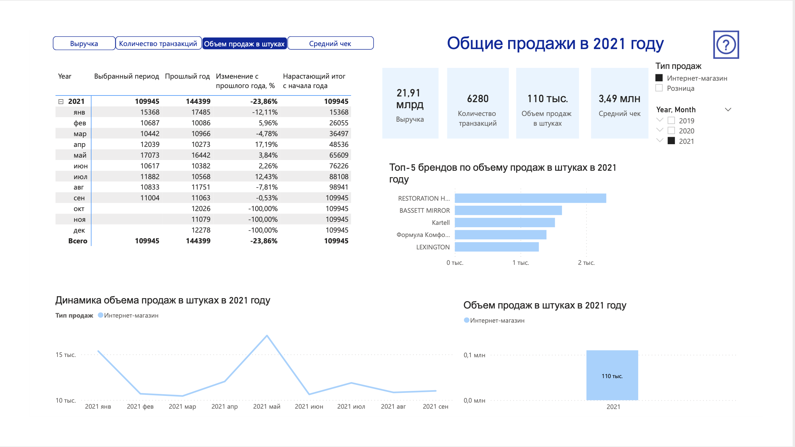

## Power BI - Оперативный анализ состояния бизнеса (цифровая трансформация)

`Курсовая.pbix` - файл проекта

`Курсовая.pdf` - PDF версия.

## Задача

Показать метрики в разбивке на интернет-магазин и розницу (в динамике):

* Выручка
* Кол-во транзакций
* Объем продаж в штуках
* Средний чек

Также мы должны дать возможность выбирать год и месяц.

Для каждой из перечисленных метрик должны показать:

* Значение за выбранный период
* Значение за такой же период прошлого года
* Изменение по сравнению с прошлым годом в процентах
* Нарастающий итог с начала выбранного года

Кроме того, заказчик хочет видеть разбивку выручки по брендам (тут уже не разбивая на интернет-магазин и розницу).

### Отчет по Интернет-магазину

Здесь были посчитаны такие метрики:

* Выручка
* Затраты на интернет-маркетинг
* Количество сессий
* Среднее количество товаров в заказе
* Кололичество уникальных покупателей
* Количество транзакций
* Маржа (выручка минус затраты)

### Основные запросы, которые были закрыты

**Первое требование** - возможность посмотреть на топ-5 медиумов по марже, а также по каждому медиуму на следующие метрики:

* Выручка, затраты и маржа 
* Доля в выручке (за весь период)
* Ранг канала по затратам, который должен учитывать только те каналы, которые мы видим в таблице.

**Второе требование** - построены графики скользящего среднего по выручке с трехмесячным окном и скользящей суммы с полугодовым окном.

Показана динамику ретеншена когорты марта 2020. 

Показана помесячная динамика количества новых покупателей. 

### Отчёт Розница

Посчитана выручку и общее количество транзакций.

Построена визуализацию. Метрики посчитаны, начиная от региона и заканчивая конкретным сотрудником отдела продаж, причем они представлены иерархически: сначала идет регион, потом все руководители в этом регионе, а под каждым руководителем - его подчиненные.

Какие в этой визуализации были вычислены метрики:

* выручка
* средний чек
* количество проданных уникальных брендов
* топ-3 бренда аутсайдера (т.е. бренды с самой низкой, но не нулевой выручкой)

Помимо визуализации с разбивкой по менеджерам, сформирована еще и визуализация с разбивкой по товарам и категориям. Здесь другой набор метрик:

* выручка
* продажи в штуках
* доля выручки от заказов, в которых покупается от 3-х штук одного товара

## Публикация отчета в интернете

Каждый менеджер должен видеть информацию только по себе, а его руководитель - по себе и всем своим подчиненным.

Присутствует фильтр по менеджеру и количеству штук товара в заказе. Доля выручки корректно считается при разных значениях в этих фильтрах.
 Отчет опубликован в Power BI Service.

## Итог

